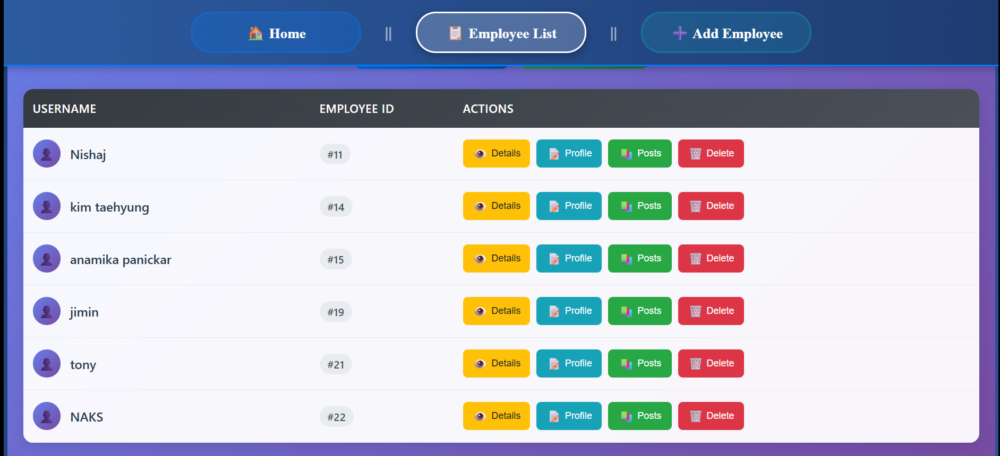
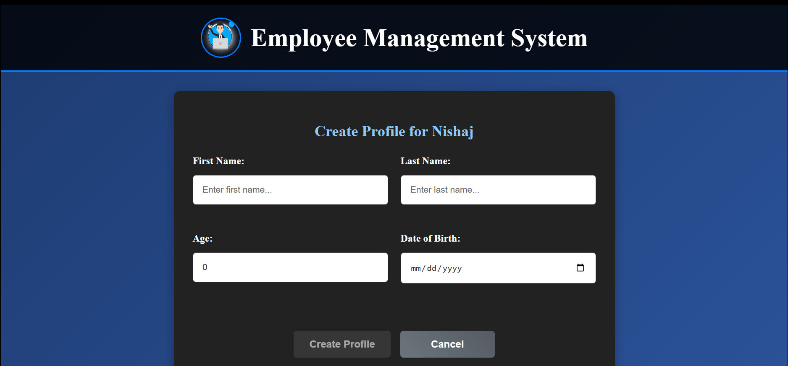
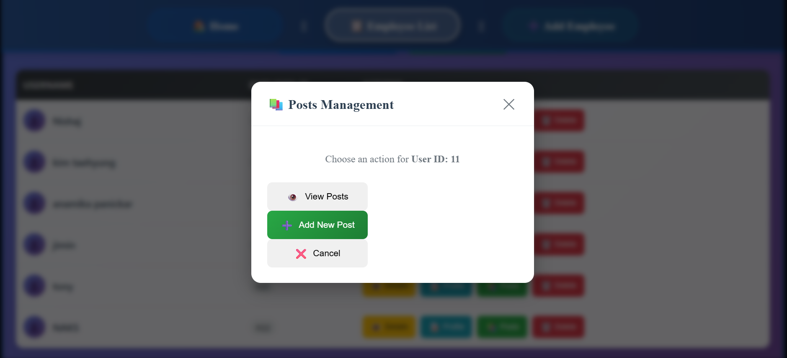

# Employee Management System - Full Stack

A complete full-stack web application for managing employees, profiles, and posts built with **Angular 17+** (frontend) and **NestJS** (backend).

## 🎯 Project Overview

This application provides a comprehensive employee management system with the following capabilities:
- Employee CRUD operations
- User profile management
- Posts creation and management
- User authentication
- Responsive design

## 🏗️ Architecture

```
┌─────────────────┐    HTTP/REST API    ┌─────────────────┐
│   Angular App   │ ◄─────────────────► │   NestJS API    │
│   (Frontend)    │                     │   (Backend)     │
│   Port: 4200    │                     │   Port: 3000    │
└─────────────────┘                     └─────────────────┘
                                                │
                                                ▼
                                        ┌─────────────────┐
                                        │  MySQL Database │
                                        │   Port: 3306    │
                                        └─────────────────┘
```

## 🛠️ Tech Stack

### Frontend (Angular)
- **Framework:** Angular 17+
- **Language:** TypeScript
- **Styling:** Custom CSS with responsive design
- **HTTP Client:** Angular HttpClient
- **Routing:** Angular Router
- **Forms:** Template-driven forms

### Backend (NestJS)
- **Framework:** NestJS
- **Language:** TypeScript
- **Database:** MySQL
- **ORM:** TypeORM/Prisma
- **Authentication:** JWT (if implemented)
- **Validation:** Class-validator

## 📋 Prerequisites

Make sure you have the following installed:
- **Node.js** (v18 or higher)
- **npm** (v9 or higher)
- **MySQL** (v8 or higher)
- **Angular CLI** (`npm install -g @angular/cli`)
- **NestJS CLI** (`npm install -g @nestjs/cli`)

## 🚀 Getting Started

### 1. Clone the Repository
```bash
git clone https://github.com/yourusername/employee-management-fullstack.git
cd employee-management-fullstack
```

### 2. Install Dependencies
```bash
# Install root dependencies and all sub-project dependencies
npm run install:all
```

### 3. Database Setup
```bash
# Login to MySQL
mysql -u root -p

# Create database
CREATE DATABASE employee_management;

# Create user (optional)
CREATE USER 'emp_user'@'localhost' IDENTIFIED BY 'your_password';
GRANT ALL PRIVILEGES ON employee_management.* TO 'emp_user'@'localhost';
FLUSH PRIVILEGES;
```

### 4. Environment Configuration

#### Backend Environment (.env in backend folder)
```env
DATABASE_HOST=localhost
DATABASE_PORT=3306
DATABASE_USERNAME=your_username
DATABASE_PASSWORD=your_password
DATABASE_NAME=employee_management

JWT_SECRET=your-super-secret-jwt-key
JWT_EXPIRES_IN=7d

PORT=3000
NODE_ENV=development
```

#### Frontend Proxy Configuration (already configured)
```json
{
  "/api": {
    "target": "http://localhost:3000",
    "secure": false,
    "changeOrigin": true
  }
}
```

### 5. Database Migration
```bash
cd backend
npm run migration:run
# or
npm run db:migrate
```

## 🏃‍♂️ Running the Application

### Development Mode (Recommended)
```bash
# Run both frontend and backend concurrently
npm run dev
```

This will start:
- **Frontend:** http://localhost:4200
- **Backend:** http://localhost:3000

### Run Individually
```bash
# Frontend only
npm run dev:frontend

# Backend only  
npm run dev:backend
```

### Production Build
```bash
# Build both applications
npm run build:all

# Serve production builds
npm run start:prod
```

## 📱 Application Features

### 🏠 Welcome Page
- Application overview
- Navigation to different sections

### 👥 Employee Management
- **List Employees** - View all employees in a responsive table
- **Add Employee** - Create new employee with username/password
- **Edit Employee** - Update employee information
- **Delete Employee** - Remove employee (with confirmation)
- **View Details** - Complete employee information

### 👤 Profile Management
- **Create Profile** - Add personal information (name, age, DOB)
- **View Profile** - Display profile information
- **Edit Profile** - Update profile data

### 📝 Posts Management
- **Create Posts** - Write posts with title and description
- **View Posts** - List all posts by user
- **Manage Posts** - Edit or delete posts

## 🌐 API Endpoints

### Employee Endpoints
```
GET    /api/users           - Get all employees
GET    /api/users/:id       - Get employee by ID
POST   /api/users           - Create new employee
PUT    /api/users/:id       - Update employee
DELETE /api/users/:id       - Delete employee
```

### Profile Endpoints
```
POST   /api/users/:id/profiles     - Create profile
GET    /api/users/:id/profiles     - Get user profile
PUT    /api/users/:id/profiles     - Update profile
```

### Posts Endpoints
```
GET    /api/users/:id/posts        - Get user posts
POST   /api/users/:id/posts        - Create new post
PUT    /api/posts/:id              - Update post
DELETE /api/posts/:id              - Delete post
```

## 🔧 Development

### Project Structure
```
employee-management-fullstack/
├── frontend/                   # Angular application
│   ├── src/
│   │   ├── app/
│   │   │   ├── components/     # Angular components
│   │   │   ├── services/       # HTTP services
│   │   │   └── models/         # TypeScript interfaces
│   │   └── assets/             # Static assets
│   ├── angular.json
│   └── proxy.config.json
├── backend/                    # NestJS application
│   ├── src/
│   │   ├── modules/            # Feature modules
│   │   ├── entities/           # Database entities
│   │   ├── controllers/        # Route controllers
│   │   └── services/           # Business logic
│   └── nest-cli.json
├── package.json               # Root package.json
└── README.md                  # This file
```

### Adding New Features
1. **Frontend:** Add components in `frontend/src/app/components/`
2. **Backend:** Add modules in `backend/src/modules/`
3. **Database:** Update entities and run migrations

## 🚀 Deployment

### Frontend (Vercel/Netlify)
```bash
cd frontend
ng build --prod
# Deploy dist folder to Vercel/Netlify
```

### Backend (Railway/Render)
```bash
cd backend
npm run build
# Deploy to Railway/Render with environment variables
```

### Database (PlanetScale/Supabase)
- Use cloud database service
- Update connection string in backend/.env

## 🧪 Testing

```bash
# Run all tests
npm run test

# Run frontend tests
npm run test:frontend

# Run backend tests
npm run test:backend
```

## 🤝 Contributing

1. Fork the repository
2. Create feature branch (`git checkout -b feature/amazing-feature`)
3. Commit changes (`git commit -m 'Add amazing feature'`)
4. Push to branch (`git push origin feature/amazing-feature`)
5. Open Pull Request

## 📄 License

This project is licensed under the MIT License - see the [LICENSE](LICENSE) file for details.

## 👤 Author

**Your Name**
- Email: your.email@example.com
- GitHub: [@yourusername](https://github.com/yourusername)

## 🙏 Acknowledgments

- Angular Team for the amazing framework
- NestJS Team for the powerful backend framework
- Community contributors and tutorials

---

**⭐ Star this repository if you found it helpful!**

## 📸 Screenshots

### Employee List


### Create Profile


### Posts Management


---

## 🔗 Live Demo

[🌐 Live Application](https://your-app-name.vercel.app) *(Replace with actual URL after deployment)*

## 📞 Support

If you have any questions or need help, feel free to:
- Open an issue on GitHub
- Contact me via email
- Check the documentation

**Happy coding! 🚀**